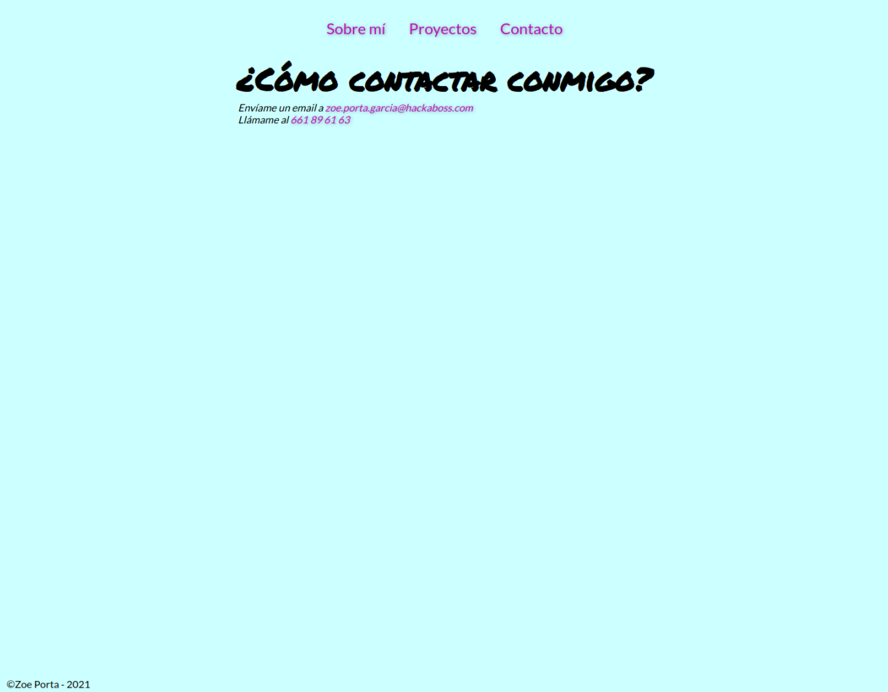

# Ejercicio 3

Crea desde cero la estructura de tu porfolio siguiendo este ejemplo:

Recuerda que de momento solo debes preocuparte por el contenido y su estructura. NO por cómo se ve.

El HTML resultante debe ser validado por el validador de HTML de la W3 y no dar ningún error.